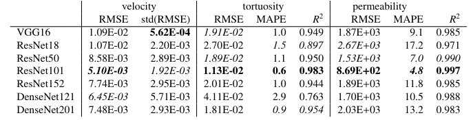

# PhysInfPorousFluidFlow

## Physics-informed convolutional neural networks for fluid flow through porous media

This repository contains the codebase for the paper

*Physics-informed convolutional neural networks for fluid flow through porous media*

## Model
The weights of the trained champion model, i.e. ResNet101 as indicated by Table 2 in the manuscript, is available in directory `models/`.
Using this weights enables to run own inference and reproduce results from the paper. 

## Dataset
Here we publish the dataset of randomly deposited circles and squares, Pcirce=0.5. 
This dataset is the one use to produce row `shape, Pcircle = 0.5` in Table 3 in the manuscript. 
The dataset consists of 490 structures and their LBM solutions.
* `dataset.evaluation/structures`: contains the images of the structures
* `dataset.evaluation/velocities_lbm`: contains the LBM solutions. The filename matches the filename of the structure. Velocities fields are written as flattened NumPy arrays.

## Model inference




Here we demonstrate how to make a predictions using the model weights and reproduce some of the results from the paper. 
Run the `run_inference.sh` which performs the evaluation and saves the results into the `dataset.evaluation/velocities_prediction`.
```
bash run_inference.sh
```
The output contains:
* `evaluation.csv_crop256`: a file that aggregates the inference results. For each structure in the dataset the MSE of predicted velocity field is given together with predicted and ground truth permeability and tortuosity. The file should look like this:
```
filename,mse,penalty_inside,penalty_div,tortuosity_target,tortuosity_pred,permeability_target,permeability_pred
pcircle=0.5000_radmin=3_radmax=8_trivialporosity=0.800873,3.0496872568619438e-05,3.3787271149776643e-06,3.7280046853993554e-06,1.1785376071929932,1.1886672973632812,18541.455078125,19398.82421875
pcircle=0.5000_radmin=3_radmax=8_trivialporosity=0.855301,4.177633672952652e-05,3.0870128284732345e-06,5.521895218407735e-06,1.1389719247817993,1.125132441520691,39148.82421875,39782.59765625
pcircle=0.5000_radmin=3_radmax=8_trivialporosity=0.759995,4.305438051233068e-05,3.7349193462432595e-06,4.482941221795045e-06,1.1572343111038208,1.1440316438674927,18464.314453125,17743.77734375
pcircle=0.5000_radmin=3_radmax=8_trivialporosity=0.781937,4.4619591790251434e-05,3.254188413848169e-06,3.826882675639354e-06,1.152785062789917,1.1394269466400146,19729.92578125,21517.62109375
pcircle=0.5000_radmin=3_radmax=8_trivialporosity=0.914963,0.0002623266773298383,6.8643207669083495e-06,1.6427933587692678e-05,1.0904499292373657,1.0744338035583496,115704.9453125,113388.1953125
pcircle=0.5000_radmin=3_radmax=8_trivialporosity=0.931046,0.004906020127236843,7.476263363059843e-06,3.850884968414903e-05,1.1052364110946655,1.0765283107757568,219463.59375,184813.671875
[...]
```
* `evaluation.csv_crop256_metrics.json`: basic metrics
* `predictions_evaluation.pickle`: binary file the stores the predicted velocity fields

The notebook `notebooks/VisualizePrediction.ipynb` shows how reproduce all the metric from Table 3 in the manuscript. 
It provides also visualization of the structures, solutions of the LBM method and corresponding predictions of the model.


### Credits
Some CNN implementations used in this repo modifies the code from [mkisantal/backboned-unet](https://github.com/mkisantal/backboned-unet)  repository.